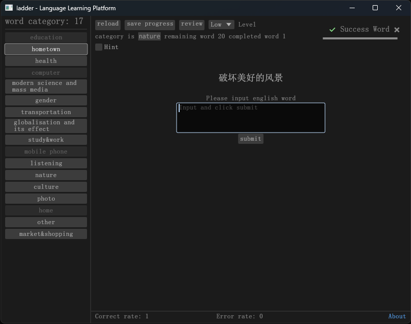

# Ladder

This is a multilingual word learning software.



## How to add words to the software

The project contains the **words.json** file, json contains learn and complete, learn represents the word being learned,
and
complete represents the word that has been learned. The next-level key of learn and complete represents the category of
the word, and the value represents the specific word.

## How to use it

After opening the software, click on the classification, enter the translation of the prompt, and click submit.

#### example

```json
{
  "learn": {
    "globalisation and its effect": {
      "经济全球化": "economic globalisation"
    }
  },
  "complete": {
    "study&work": {
      "融入某人的日程表": "fit into one`s schedule"
    }
  }
}
```

# Install

`cargo add ladder`
or
`cargo build --release`